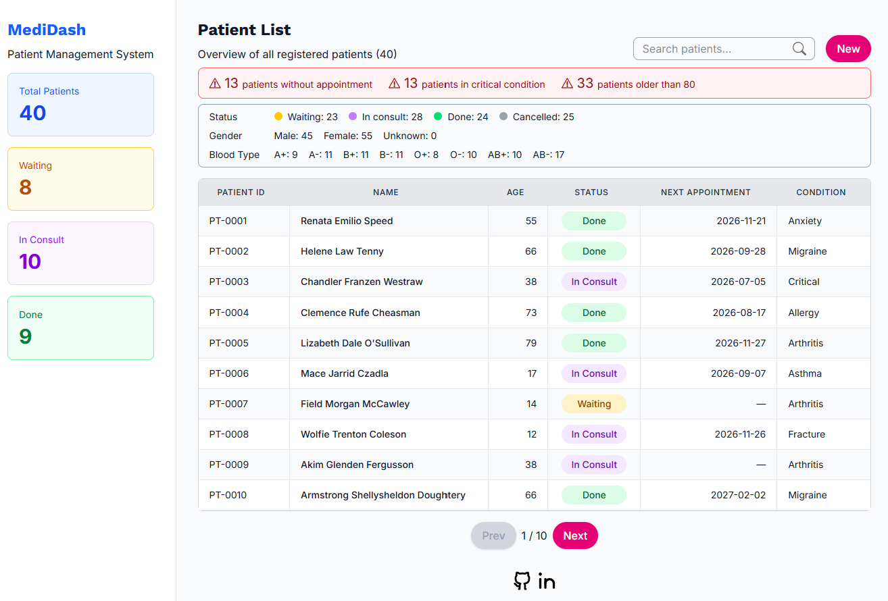
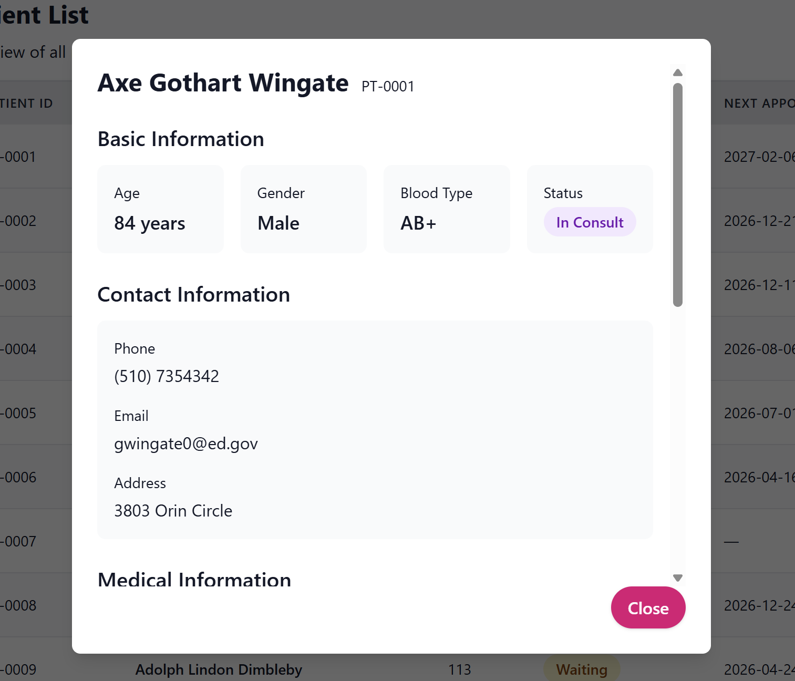

# MediDash #
**Timeline:** 2 months (Weekdays, 1-2 hours/day)  
**Project:** Simple patient management dashboard for hospital staff.





## Project Overview ##

**MediDash** is a simple, single-page dashboard to manage patients.
- Patient list (table)
- Overview (Sticky sidebar)
- Click a row -> Detail (Modal)
- Click a column of the header row -> order
- Search bar
- Pagination
- StatsPanel 
- AlertsList 
- CRUD (Create / Edit / Delete)
- Technology: React, Next.js, TypeScript, Hooks, Storybook, TailwindCSS, Fake Patients ([API](https://www.mockaroo.com/))

## Weekly Plan (8 weeks) ##

### Week 0: Preparation ###
- Brainstorm
- Wireframe
- Figma (https://scan-grain-66542119.figma.site/)
- Tech stack

#### Week 1: Setup & Layout ####
- Create React/TypeScript/NextJS project with
- Install TailwindCSS
- Install Storybook
- Initialize Git repository
- Basic HTML, CSS, and Layout
- Display placeholder components

#### Week 2: UI Components & Storybook ####
- Hook: useState for local state
- Type Patient and Patients
- Start fake data with Mockaroo
- UI components: Heading, Parapraph, Card, Table, Badge, Button
- Write Storybook stories
- Display table and modal with fake data
- Storybook: basic UI elements and components

#### Week 3: Filtering & Sorting ####
- Hook: useState, useMemo, custom Hooks
- Search bar on the header
- Filtering with clicking on the Sidebar's cards
- Ordering the table with clicking on the table header cells
- Storybook: filtered / sorted states
- Custom Hook "usePatients (sorting, filtering, ordering)"

#### Week 4: Derived Data UI & Callbacks ####
- Hook: useMemo, useCallback
- StatsPanel (counts by status, gender, blood type)
- AlertsList (patients filtered by simple rules)
- Storybook: StatsPanel, AlertsList

#### Week 5: API Integration ####
- Hook: useEffect, useState
- Fetch data from Mockaroo
- Handle loading / error states
- Pagenation
- Storybook: skelton, pagenation

#### Week 6: Custom Hooks ####
- usePatients（API + filtering + sorting + loading）
- useStats for stats calculation
- Separate UI and logic
- Cache

#### Week 7: Accessibility & Responsive Design ####
- Semantic HTML
- ARIA labels, focus management
- Table keyboard navigation
- Responsive design

#### Week 8: Finalization ####
- Organize Storybook
- Write README
- CRUD (Add/Edit/Delete)
- Documentation

### Future Considerations ###
- Implement routing for patient detail pages
- Sync search and filter state with URL query parameters
- Improve SEO when converting to a public-facing app
- Test (Vitest, Jest, Cypress)

## Demo ## 
[Demo in Vercel](https://medidash-steel.vercel.app/)

## Getting Started ##

Install dependencies:

```bash
npm install 
```

Start the development server:

```bash
npm run dev
# or
yarn dev
# or
pnpm dev
# or
bun dev
```

Storybook:
```bash
npm run storybook
```


